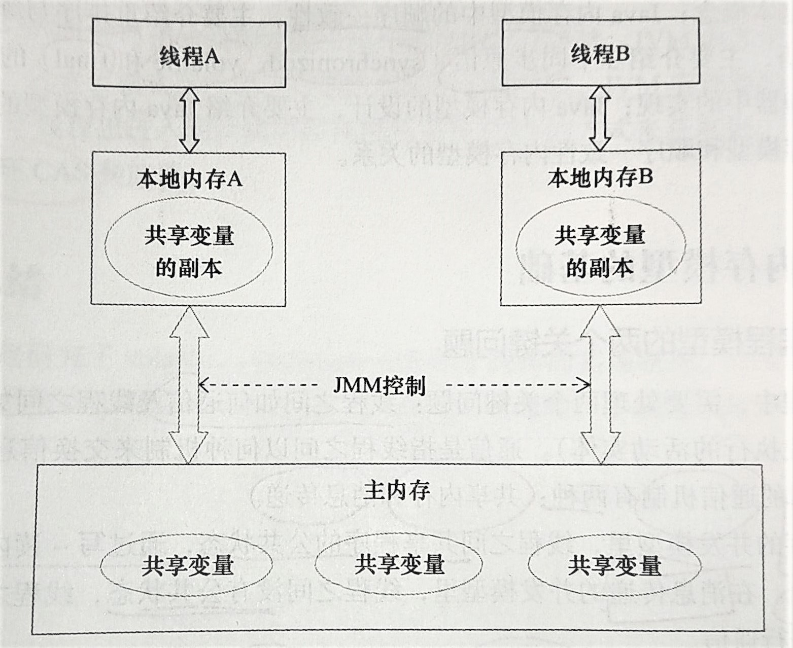

# 第3章 Java内存模型

内存模型

内存模型中的顺序一致性，重排序以及顺序一致性内存模型

同步原语：synchronized，volatile，final

## 一、Java内存模型的基础

#### 1.1. 并发编程模型的两个关键问题（通信、同步）：

* 线程之间如何**通信**
* 线程之间如何**同步**

线程之间**通信**机制有两种：共享内存、消息传递

**同步**：**程序中用于控制不同线程间操作发生相对顺序的机制**。

两种并发模型：

* **共享内存**：（Java采用该并发模型）

  通信：线程之间共享程序的公共状态，通过写-读内存中的公共状态进行<u>隐式</u>通信。

  同步：<u>显式</u>进行，程序员必须<u>显式指定</u>某个方法或某段代码需要在线程之间互斥执行。

* **消息传递**：

  通信：显式，线程之间没有公共状态，线程之间必须通过发送消息来<u>显式</u>通信。

  同步：隐式，由于消息发送必须先于接收，所以同步是隐式进行的。

<u>Java采用的是**共享内存**模型</u>

### 1.2. Java内存模型的抽象结构



Java线程之间的通信由Java内存模型（JMM）控制，JMM决定一个线程对共享变量的写入合适对另一个线程可见。

抽象角度看：

线程之间的**共享变量存储在主内存**（Main Memory）；每个**线程都有一个私有的本地内存**（抽象概念，不真实存在）；**本地内存中存储了该线程以读/写共享变量的副本**。

A-->B的通信步骤：

1. 线程A把本地内存A中**更新过的共享变量刷新到主内存**中。
2. 线程B**到主内存中读取**线程A之前已更新过的共享变量。

**实质**：线程A在向线程B发消息，而且**必须经过主内存**。

<u>JMM通过控制主内存与每个线程的本地内存之间的交互，来为Java程序员提供内存可见性保证。</u>


### 1.3. 从源代码到指令序列的重排序

为了提高执行程序的性能，编译器和处理器常常会对指令做重排序(3种)。

```flow
op1=>operation: 源代码
op2=>operation: 1：编译器
优化重排序
op3=>operation: 2：指令级
并行重排序
op4=>operation: 3：内存系统
重排序
op5=>operation: 4：最终执行的指令序列

op1(right)->op2(right)->op3(right)->op4(right)->op5
```

1. 编译器优化的重排序。编译器在不改变单线程程序语义的前提下，重新安排语句执行顺序。
2. 指令级并行的重排序。处理器采用指令级并行技术将多条指令重叠执行。（如无数据依赖可改变执行顺序）
3. 内存系统的重排序。由于处理器使用缓存和读/写缓冲区，使得加载和存储操作看上去是在乱序执行。

每个处理器写缓冲区仅对自己可见，这会导致处理器执行内存操作的顺序会与内存实际的操作执行顺序不一致。因此现代的处理器都会允许对写-读操作进行重排序。

JMM通过禁止某些编译器重排序（插入内存屏障）和处理器重排序，为程序员提供一致的内存可见性保证。


### 1.4. happens-before

Java的JSR-133内存模型使用happens-before的概念来阐述操作之间的内存可见性。

在JMM中，如果一个操作执行的结果需要对另一个操作可见，那么这两个操作之间必须要存在happens-before关系。（两个操作可以是同一线程内，也可以是不同线程之间）

+ **happens-before**仅仅要求**前一个操作执行的结果对后一个操作可见**，且前一个操作按**顺序**排在第二个操作之前。**并不意味**着前一个操作必须在后一个操作前执行！

与**程序员密切相关的happens-before规则**如下：

+ **程序顺序规则**：一个线程中的**每个操作**，**happens-before于**该线程中的任意**后续操作**。（同一线程内顺序排序）
+ **监视器锁规则**：对一个锁的**解锁**，**happens-before于**随后对其**加锁**。（解锁-->加锁）
+ **volatile变量规则**：对一个**volatile域的写**，**happens-before于**任意后续对这个**volatile域的读**。（写-->读）
+ **传递性**：如果A happens-before B，且B happens-before C，那么A happens-before C

happens-before与JMM的关系：

```flow
op1=>start: 程序员
op2=>operation: happens-before 规则
(JMM呈现给程序员的视图部分）
op3=>operation: 禁止某种类型的
编译器/处理器重排序
( JMM的实现 )
op4=>operation: 处理器/编译器重排序规则
(JMM定义的规则)

op1(right)->op2(right)->op3(right)->op4
```

## 二、重排序

重排序是指编译器和处理器优化程序性能而对指令序列进行重新排序的一种手段。

### 2.1. 数据依赖性

两个操作访问同一个变量，其中一个是写操作，则存在数据依赖性。

分为：

+ 写后读
+ 写后写
+ 读后写

上述三种情况，只要重排序两个操作，执行结果就会被改变。

编译器和处理器会遵守数据依赖性，不会改变存在数据依赖关系的两个操作的执行顺序（仅针对单个处理器和单个线程中的操作，不同处理器之间和不同线程之间的数据依赖性不被考虑）


###2.2. as-if-serial语义

**as-if-serial：不管怎么重排序，（单线程）程序的执行结果不能被改变。**

编译器、runtime、处理器都**必须遵守**as-if-serial语义，因此它们**不会对存在数据依赖关系的操作**做重排序。

as-if-serial语义**保护了单线程**程序。使单线程程序员无需担心重排序会干扰到程序和内存可见性问题。

### 2.3. 程序顺序规则

软件和硬件技术准求的目标：在**不改变程序执行结果**的前提下，尽可能**提高并行度**。

编译器和处理器遵从这一目标，JMM也同样遵从这一目标(happens-before)

### 2.4. 重排序对多线程的影响

控制依赖：（if(xxxx) yyyy;	//x与y操作之间存在控制依赖关系）

当代码中存在控制依赖性时，会影响序列执行的并行度。编译器和处理器会采用猜测执行来客服控制相关性对并行度的影响。（猜测：在控制条件前提前读取数据并计算，将计算结果临时保存到名为重排序缓冲的硬件缓冲中）

**单线程**中对存在**控制依赖**的操作进行重排序**不影响**结果（所以as-if-serial语义允许对其重排序）

但在**多线程中，对存在控制依赖的操作重排序可能会<u>改变</u>程序的执行结果**。


## 三、顺序一致性

### 3.1. JMM的内存一致性保证

JMM对正确同步的多线程程序的内存一致性做了如下保证：

如果程序是正确同步的，程序的执行将具有顺序一致性（执行结果与顺序一致性模型相同）//（这里的同步适用于同步原语synchronized、volatile、final的正确使用）。

### 3.2. 顺序一致性模型

顺序一致性模型是一个**理想化**的理论参考模型（实际上完全实现的代价很大），它为程序员提供了极强的内存可见性保证。


**顺序一致性内存模型**的视图（如上图）：**任意时间点最多只有任意一个线程可以连接到内存**，当多个线程并发执行时，能把所有线程的所有内存读写都串行化。

它有**两大特性**：

1. 单个线程中的所有操作必须按照程序的顺序来执行**（JMM没有保证这点，临界区内可以重排序）**

2. （不管程序是否同步）**所有线程都只看得到唯一的操作执行顺序，**每个操作都必须**原子执行**且**立即对所有线程可见**。

   对此，**JMM只保证同步程序的顺序一致性**，<u>这是由Java内存模型决定的</u>：在未同步程序中，不但整体的执行顺序是无序的，线程锁看到的操作执行顺序也可能不一致：A线程写到A本地内存后，自以为执行结束，实际上还没刷入主内存，这相对于B线程是不立即可见的，即看到的执行顺序不一致（这里要结合上面的JAVA内存模型思考）

   此外，**JMM不保证对64位long和double变量的写操作具有原子性**（读操作有原子性）（这是由总线带宽决定的，在32位处理器上，64位可能会被拆成2个32位执行。）（这点可以用锁来保证原子性）


### 3.3. Java同步程序的顺序一致性效果

```java
class SynchronizedExample {
    int a = 0;
    boolean flag = false;
    
    public synchronized void writer() {		//获得锁
        a = 1;
        flag = true;
    }									//释放锁
    
    public synchronized void reader(){	//获得锁
        if (flag) {				//临界区，其内可以重排序（JMM会在临界区创建顺序一致性模型内存视图）
            int i = a;			//由于监视器互斥执行的特性，
            ......				//其他线程无法得知该线程访问临界区内的重排序
        }						//这种重排序能够提高执行效率而且保证执行结果
    }								//释放锁
}
```

### 3.4. 未同步程序的执行特性

对于未同步或未正确同步的多线程程序，JMM只提供最小安全性：线程执行读到的值，要么是之前某线程写入的值，要么是默认值（0，Null，False），JMM只保证线程读取到的值不会无中生有冒出来。


## 四、volatile

<u>volatile可以看作为使用同一个锁对volatile变量进行单个读或写做了同步。</u>

volatile变量的特性：

+ **可见性**：对一个volatile变量的**读，总是能看到（任意线程）对这个volatile变量最后的写入**。
+ **原子性**：对任意**单个**volatile变量的**读/写**具有原子性，<u>但类似于volatile++这种复合操作不具有原子性。</u>


从内存语义的角度来说，volatile变量的写-读 与 锁的释放-获取 有相同的内存效果。

+ volatile写和锁的释放具有相同的内存语义；
+ volatile读与锁的获取具有相同的内存语义

举例分析一下：

```java
class VolatileExample{
    int a = 0;
    volatile boolean flag = false;
    
    public void writer(){
        a = 1;		 //1
        flag = true; //2
    }
    
    public void reader(){
        if (flag) {		//3
            int i = a;	//4
        }
    }
}
```

根据程序次序规则：1 happens-before 2; 3 happens-before 4

根据volatile规则：2 happens-before 3

根据happens-before的传递性：1 happens-before 4

也就是：

```flow
op1=>operation: 1: 线程A修改共享变量
op2=>operation: 2: 线程A写volatile变量
op3=>operation: 3: 线程B读同一个volatile变量
op4=>operation: 4: 线程B读共享变量

op1->op2(right)->op3->op4
```

A写了一个volatile变量之后，B读同一个volatile变量。

A线程在写volatile变量之前所有可见的共享变量，在B线程读了同一个volatile变量之后，立即变得对B线程可见。（这句话可以用下面的内存语义结合内存模型理解）

+ （个人理解：写volatile变量即为解锁，读volatile即为加锁，因为任何线程都可以原子性地单独读/写volatile变量，所以volatile不会造成死锁）

### 3.2. volatile 写-读的内存语义（与锁的释放-获取内存语义相似）

volatile**写**的内存语义：（同释放锁）

+ **写一个volatile变量时**，JMM会把该线程对应的本地内存中的**共享变量值刷新到主内存**）

volatile**读**的内存语义：（同获取锁）

+ **读一个volatile变量时**，JMM会把该线程对应的**本地内存置为无效**，线程接下来将**从主内存中读取共享变量**。

#### 3.2.1. 写-读volatile变量的内存语义实质：（与锁的释放-获取内存语义相似）

+ 线程A**写**一个volatile变量，实质上是线程A向接下来要读这个volatile变量的某个线程**发出了（其对共享变量所做出的修改）的消息**。
+ 线程B**读**一个volatile变量，实质上是线程B**接受了**之前某个线程发出的**（在写这个volatile变量之前对共享变量所做的修改）的消息**。
+ 线程A写一个volatile变量，随后线程B读这个volatile变量，这个过程**实质**上是线程A**通过主内存**向线程B**发消息**。

### 3.3. volatile 内存语义的实现

JMM对volatile制定的重排序规则：

+ volatile写之前的操作绝对不会重排序到其之后。
+ volatile读之后的操作不会重排序到其之前。
+ volatile写在volatile读之前时，不会重排序。

这些规则都是使用插入内存屏障来解决的（编译器会适当减少不必要、重复的内存屏障）。


## 五、锁的内存语义

锁可以让临界区互斥执行，还可以让释放锁的线程向获取同一个锁的线程发送消息。

```java
class MonitorExample {
    int a = 0;
    public synchronized void writer() {	//1 获得锁
        a++;					 	  //2 执行临界区代码
    }								 //3 释放锁
    
    public synchronized void reader() {	//4
        int i = a;					   //5
    }								  //6
}
```

假设线程A执行writer，然后线程B执行reader。根据happens-before原则推导得出：2 happends-before 5

因此，线程A在释放锁之前的所有可见的共享变量，在线程B获取同一个锁之后将立刻变得对B线程可见。


### **内存语义**：（与volatile具有相同的内存语义）

+ **释放锁**时，JMM把该线程的本地内存中的**共享变量会刷新到主内存**中
+ **获得锁**时，JMM将该线程对应的**本地内存置为无效**，并且**从主内存中读取共享变量**。

实质上也是在**通过主内存发送消息**。


### 5.3. ReentrantLock的实现方式（以此例讲锁的内存语义实现方式）

ReentrantLock的实现依赖于Java同步器框架AbstractQueuedSynchronizer(简称AQS)。AQS**使用一个整形的volatile变量（state）来维护同步状态**。

```java
class ReentrankLockExample {
    int a = 0;
    ReetrantLock lock = new ReetrantLock();
    public void writer(){
        lock.lock();
        try {
            a++;
        } finally {
            lock.unlock();
        }
    }
}
```

+ **公平锁：**
  + 获取锁：读volatile变量
  + 释放锁：写volatile变量
+ **非公平锁：**
  + 获取锁：用原子性的CAS（compareAndSet）操作更新volatile变量（**CAS同时具有volatile读和写的内存语义**）
  + 释放锁：写volatile变量

### 5.4. 锁内存语义的两种实现方式

+ 利用**volatile的写-读所具有的内存语义**。
+ 利用**CAS所同时附带的volatile读和volatile写的内存语义**。

这两种方式可以实现线程之间的通信。

### 5.5. concurrent包的实现

+ A线程写volatile变量，随后B线程读这个volatile变量
+ A线程写volatile变量，随后B线程CAS更新这个volatile变量
+ A线程CAS更新volatile变量，随后B线程CAS更新这个volatile变量
+ A线程CAS更新volatile变量，随后B线程读这个volatile变量

（其实就是利用锁语义的实现方式做了个排列组合）

**通用的实现模式：**

1. 声明共享变量为volatile；
2. 使用CAS的原子条件更新来实现线程之间的同步；
3. 配合以volatile读/写和CAS所具有的volatile读和写的内存语义来实现线程之间的通信。


## 六、final域的内存语义

与锁和volatile相比，对final域的读写更像是普通变量的访问。

### 6.1. final域的重排序规则

+ 写：禁止把final域的写重排序到构造函数之外。这可以保证在对象引用为任意线程可见之前，该对象的final域已经被正确初始化了（普通域不具有这个保证）
+ 读：初次读对象的<u>引用</u> 限定在 初次读该对象<u>包含的final域</u> 之前。（确保在读一个<u>对象的final域</u>之前，一定会先读包含了这个final域的对象的<u>引用</u>。
+ 只要对象是正确构造的（不在构造函数中逸出），那么不需要使用同步（volatile和lock）就可以保证任意线程都可以看到这个final域在构造函数中被初始化之后的值。

### 6.2. 当final域为引用类型时

+ 对final域为引用类型的多线程读写时，就像对普通域一样读写，是存在数据竞争的，这时候需要用同步原语（lock和volatile）来确保内存可见性。

final引用不能从构造函数内溢出：

写final域的保证：这可以保证在对象引用为任意线程可见之前，该对象的final域已经被正确初始化了

前提：构造函数内部，不能让这个被构造函数的引用为其他线程可见，也就是说对象应用不能在构造函数中“溢出”。（因为此时的final域肯恩给还没有被初始化）

```java
/* 错误的构造示例 */
public class FinalReferenceEscapeExample {
    final int i;
    static FinalReferenceEscapeExample obj;
    
    public FinalReferenceEscapeExample () {
        i = 1;		//写final域
        obj = this;				//this引用再次溢出了（对外可见了）这是不正确的构造
    }
    
    public static void writer() {	//A线程写
        new FinalReferenceEscapeExample();	//创建一个实例，调用了构造函数
    }
    public static void reader() {		//B线程读
        if (obj != null) {
            int temp = obj.i;		
        }
    }
}
```

在这里，A线程写调用构造函数返回前，该对象的引用就变得对线程B可见了，这可能会导致i在被初始化之前就被读取。（虽然final保证final的写不被重排序到构造函数之外，但构造函数结束之前就被暴露了出来，可能会被B线程在final域未被初始化前提前读取）。


## 七、happens-before

happens-before是JMM最核心的概念。对于程序员来说，理解happens-before是理解JMM的关键。

### 7.1. JMM的设计


+ 程序员希望内存模型易于理解和编程，是个强内存模型。JMM对此向程序员提供happens-before规则保证了内存可见性。
+ 编译器和处理器对内存模型的实现希望束缚越少越好以提高性能，是个弱内存模型。JMM规定只要不改变程序（单线程）的执行结果，编译器和处理器怎么优化都行。


### 7.2. happens-before的定义

+ 如果一个操作happens-before 另一个操作，那么第一个操作的执行结果将对第二个操作可见，而且第一个操作的执行顺序排在第二个操作之前。
+ 两个操作之间存在happens-before 关系，并不意味着执行顺序一定是happens-before指定的顺序。